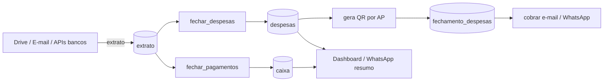

# Plano — Plataforma de Gerenciamento de Condomínio (Auto Síndico)

> Documento de planejamento. Nenhuma alteração de código é feita por este plano;
> ele serve de guia para implementação faseada e aprovada pelo responsável.

---

## 1. Visão geral

Transformar o Auto Síndico de um sistema **mono-condomínio com dados fixos** em uma
**plataforma multi-condomínio (multi-tenant)**, onde:

- **Cada usuário** tem um papel: **síndico** (gerencia prédios) ou **morador** (vinculado a um apartamento).
- **Cada síndico** pode gerenciar **um ou mais prédios**.
- **Cada prédio** pode **cadastrar novos apartamentos** (hoje fixos em AP1–AP4).
- Apartamentos passam a ser **configuráveis**: vínculo de moradores, e-mail, telefone,
  e **identificadores de pagamento** (nomes/termos que aparecem no extrato e indicam quem pagou).
- A **coleta de caixa** (hoje fixa em R$ 100,00 via `caixa_mapping`) passa a ser
  **customizável por prédio e por apartamento**.
- Para apartamentos cujo **caixa é pago por outra pessoa**, existe a opção de apontar
  **quem paga o caixa** (outro apartamento/morador) tanto na configuração quanto no
  momento de **marcar um pagamento para um apartamento**.
- Categorias de despesa (enel, sabesp, faxina, outros) passam a ser **customizáveis por prédio**,
  incluindo os **identificadores** usados para classificar lançamentos do extrato.
- Existe uma **tela de classificação manual** para marcar um pagamento específico em uma categoria.

---

## 2. Diagnóstico do estado atual (pontos de rigidez)

| Componente | Onde está fixo | Impacto |
|---|---|---|
| Apartamentos | `util/identificadores.py` (`apartamento1..4`), colunas `caixa` (`pagamentos_ap1..4`, `caixa_ap1..4`), `despesas` (`valor_mensal_ap1..4`) | Não permite mais/menos apartamentos |
| Mapeamento e-mail/telefone | `util/identificadores.py` (`email_mapping`, `telefone_mapping`) | E-mail/telefone dos moradores hardcoded |
| Identificadores de pagamento | `util/identificadores.py` (listas de nomes por AP) e `service/fechamento_despesas.py` (`identificacao_sabesp`, `identificacao_enel`, `identificacao_outros`) | Classificação automática rígida |
| Coleta de caixa | `util/identificadores.py` (`caixa_mapping` = `{'AP1': 0, 'AP2': 100, 'AP3': 100, 'AP4': 100}`) | Valor fixo de R$ 100; não permite quem paga o caixa de outro AP |
| Categorias de despesa | `repository/despesas.py` (colunas `enel`, `sabesp`, `faxina`, `outros`) | Não permite novas categorias |
| Fechamento de pagamentos | `service/fechamento_pagamento.py` (percorre `apartamento1..4` e grava `Caixa`) | Atribuição de pagamento fixa por lista |
| Cobrança (e-mail/WhatsApp) | `service/cobrar_service.py` (usa `email_mapping`/`telefone_mapping`) | Destinatários fixos |
| Dashboard/relatórios | `home.html`, `dto/totalizacao.py`, `repository/concialicao.py`, `service/message_whatsapp.py` | Colunas e totais fixos AP1–AP4 |
| Fechamento de despesas | `service/fechamento_despesas.py` (gera QR por `caixa_mapping`) | Valor de caixa por AP fixo |

**Fluxo atual resumido:**

---

## 3. Modelo de dados alvo (novas tabelas)

Banco: MySQL (mesmo `config/database.py`). Segue o padrão declarativo/`get_session()` do projeto.

### 3.1 `predios`
| coluna | tipo | obs |
|---|---|---|
| `id` | INT PK AI | |
| `sindico_id` | INT FK `usuarios.id` | dono do prédio |
| `nome` | VARCHAR(255) | ex.: "Condomínio Jardim" |
| `endereco` | VARCHAR(255) NULL | opcional |
| `valor_caixa_padrao` | DECIMAL(10,2) | valor padrão de coleta de caixa por apartamento (default `100.00`) |
| `created_at` | DATETIME | default now |

### 3.2 `apartamentos`
| coluna | tipo | obs |
|---|---|---|
| `id` | INT PK AI | |
| `predio_id` | INT FK `predios.id` | |
| `identificador` | VARCHAR(50) | ex.: `AP1`, `101`, `Bloco A-12` |
| `numero` | VARCHAR(50) NULL | número/andar opcional |
| `valor_caixa` | DECIMAL(10,2) NULL | **customizável**; `NULL` = usa `predios.valor_caixa_padrao` |
| `caixa_pago_por` | VARCHAR(255) NULL | **opcional** — nome da pessoa que paga o caixa deste AP; vazio = o próprio AP paga |
| `ordem` | INT | ordenação nas telas |
| `ativo` | BOOL | default true |
| `created_at` | DATETIME | |

> **Decisão (caixa):**
> - `valor_caixa` substitui o `caixa_mapping` fixo → cada apartamento pode ter valor próprio.
> - `caixa_pago_por` (string, opcional) indica o **nome da pessoa** que paga o caixa do AP.
>   Quando preenchido, o caixa é cobrado/atribuído ao apartamento cujo morador tem esse nome
>   (ou o tem em seus identificadores); caso contrário, o próprio AP paga.
>   Ex.: AP2 tem `caixa_pago_por = "Filipe"` → o caixa de R$ 100 do AP2 entra no QR de cobrança
>   do apartamento de Filipe.

### 3.3 `moradores`
| coluna | tipo | obs |
|---|---|---|
| `id` | INT PK AI | |
| `apartamento_id` | INT FK `apartamentos.id` | |
| `usuario_id` | INT FK `usuarios.id` NULL | vinculo opcional com conta |
| `nome` | VARCHAR(255) | |
| `email` | VARCHAR(255) NULL | destino da cobrança |
| `telefone` | VARCHAR(50) NULL | WhatsApp |
| `responsavel_pagamento` | BOOL | marca **quem paga** (usuário do extrato) |
| `identificadores_pagamento` | JSON | termos que casam com `extrato.identificacao` (ex.: `["caue beloni", "raquel santos"]`) |
| `ativo` | BOOL | default true |
| `created_at` | DATETIME | |

> **Decisão:** os identificadores de pagamento ficam no **morador responsável**
> (1 por apartamento em geral), porque é o nome/CNPJ/termo que aparece no extrato.

### 3.4 `caixa_geral` (substitui `caixa`)
| coluna | tipo | obs |
|---|---|---|
| `id` | INT PK AI | |
| `predio_id` | INT FK `predios.id` | |
| `apartamento_id` | INT FK `apartamentos.id` | |
| `mes` | VARCHAR(255) | |
| `ano` | INT | |
| `pagamentos` | DECIMAL(10,2) | total creditado no mês p/ o AP |
| `caixa` | DECIMAL(10,2) | `pagamentos - valor_mensal` |
| `created_at` | DATETIME | |

**Única chave lógica:** `(predio_id, apartamento_id, mes, ano)` → permite N apartamentos.

### 3.5 `categorias_despesa`
| coluna | tipo | obs |
|---|---|---|
| `id` | INT PK AI | |
| `predio_id` | INT FK `predios.id` | |
| `nome` | VARCHAR(100) | ex.: `enel`, `sabesp`, `faxina`, `outros` |
| `cor` | VARCHAR(20) NULL | exibição (hex) |
| `ordem` | INT | ordenação |
| `ativo` | BOOL | default true |
| `created_at` | DATETIME | |

### 3.6 `despesas_geral` (substitui `despesas`)
| coluna | tipo | obs |
|---|---|---|
| `id` | INT PK AI | |
| `predio_id` | INT FK `predios.id` | |
| `mes` | VARCHAR(255) | |
| `ano` | INT | |
| `categoria_id` | INT FK `categorias_despesa.id` | |
| `valor` | DECIMAL(10,2) | valor da categoria no mês |
| `created_at` | DATETIME | |

**Chave lógica:** `(predio_id, mes, ano, categoria_id)`. Valor mensal por AP =
`total do prédio / qtd de apartamentos ativos` (comportamento atual `total / 4`).

### 3.7 `classificacao_manual` (tela de marcar pagamento em categoria)
| coluna | tipo | obs |
|---|---|---|
| `id` | INT PK AI | |
| `predio_id` | INT FK `predios.id` | |
| `codigo_transacao` | VARCHAR(255) | chave do lançamento no `extrato` |
| `categoria_id` | INT FK `categorias_despesa.id` | |
| `usuario_id` | INT FK `usuarios.id` | quem classificou |
| `created_at` | DATETIME | |

**Decisão:** usar `codigo_transacao` (chave única de negócio do extrato) para não
duplicar classificação ao reprocessar; nova leitura do extrato respeita a regra manual.

---

## 4. Estratégia de migração

Criar **`scripts/migrar_para_caixa_geral.py`** (executado uma única vez; idempotente).

### 4.1 Passos
1. **Criar tabelas** novas via `Base.metadata.create_all` (ou DDL explícito).
2. **Prédio padrão**: criar `Predio(nome="Prédio Padrão", valor_caixa_padrao=100.00)` vinculado
   ao usuário `admin`/`maintainer` existente (o síndico atual). Se não existir, pedir/`--sindico-email`.
3. **Apartamentos**: criar `AP1..AP4` (mesma ordem atual) no prédio padrão, com
   `valor_caixa = caixa_mapping[APn]` (AP1=0, AP2/AP3/AP4=100) e
   `caixa_pago_por_id = NULL` (cada AP paga o próprio caixa, comportamento atual).
4. **Moradores**: para cada `apartamentoN` de `util/identificadores.py`, criar moradores
   com:
   - `nome` = cada item da lista,
   - `email` = `email_mapping[APn]`,
   - `telefone` = `telefone_mapping[APn]`,
   - `responsavel_pagamento = True` no primeiro da lista,
   - `identificadores_pagamento` = lista de nomes do apartamento.
5. **Categorias**: criar `enel` (identificadores de `identificacao_enel`), `sabesp`
   (`identificacao_sabesp`), `faxina` (termo `edileuza`), `outros` (`identificacao_outros`).
   Guardar os identificadores **nas tabelas** (novo campo `identificadores JSON`
   em `categorias_despesa` — ver 3.5, adicionar a coluna).
6. **Migrar `despesas` → `despesas_geral`**: para cada linha de `despesas`,
   gravar 1 linha por categoria existente (enel, sabesp, faxina, outros) no prédio padrão.
7. **Migrar `caixa` → `caixa_geral`**: para cada linha de `caixa`, gravar 1 linha
   por apartamento (`caixa_geral.apartamento_id` mapeado de `AP1..4`), com
   `pagamentos = pagamentos_apN` e `caixa = caixa_apN`.
8. **Migrar `fechamento_despesas`**: manter tabela, mas adicionar `apartamento_id`
   (FK) preenchido pelo `apartamento` (string) → novo id.
9. **Log**: registrar contagens migradas e eventuais divergências em arquivo `migracao.log`.
10. **Rollback/segurança**: NÃO dropa `caixa`/`despesas`; apenas cria `caixa_geral`/`despesas_geral`.
    As tabelas antigas ficam preservadas até validação em produção.

### 4.2 Idempotência
- Antes de inserir, checar se prédio/apartamentos/categorias já existem (por chave lógica);
- Reexecução não duplica registros.

---

## 5. Camada de repositório (novos arquivos)

Seguir o padrão existente (`declarative_base`, `get_session()`).

- `repository/predio.py` — `Predio`, `listar_por_sindico(sindico_id)`, `buscar_por_id`, `salvar`.
- `repository/apartamento.py` — `Apartamento`, `listar_por_predio`, `buscar_por_id`, `salvar`, `desativar`.
- `repository/morador.py` — `Morador`, `listar_por_apartamento`, `responsavel_pagamento(apartamento_id)`, `salvar`.
- `repository/caixa_geral.py` — `CaixaGeral`, `upsert(predio, ap, mes, ano, pagamentos, caixa)`,
  `listar_por_predio_mes`, `consultar_total`.
- `repository/categoria_despesa.py` — `CategoriaDespesa`, `listar_por_predio`, `salvar`, `buscar_por_nome`.
- `repository/despesa_geral.py` — `DespesaGeral`, `upsert`, `listar_por_predio_mes`.
- `repository/classificacao_manual.py` — `ClassificacaoManual`, `buscar_por_codigo`, `salvar`.

> **Nota:** `repository/fechamento_despesas.py` recebe apenas a coluna `apartamento_id`
> (mantendo compatibilidade com `apartamento` string enquanto migra).

---

## 6. Alterações nos serviços existentes (remover hardcodes)

### 6.1 `service/fechamento_pagamento.py`
- Ler **apartamentos e moradores responsáveis** do banco (via `repository/`), montando
  uma lista de `(apartamento_id, identificadores_pagamento)`.
- Para cada lançamento de **crédito** (`get_transacao_credito(banco)`), verificar se
  `identificacao` casa com algum morador responsável e **somá-lo ao apartamento correto**.
- Gravar em `CaixaGeral` via `upsert` (1 linha por AP), em vez de `Caixa` com colunas fixas.
- Calcular `valor_mensal` por AP = `total_despesas / qtd_apartamentos_ativos`.
- **Caixa (ver 6.6):** o crédito do morador paga primeiro o `valor_mensal` + o caixa do
  próprio AP e, se o AP estiver marcado como pagador do caixa de outro AP
  (`caixa_pago_por_id`), o valor restante/adicional é creditado como **caixa desse outro AP**.
- `caixa_geral.caixa` passa a refletir a soma dos créditos de caixa atribuídos ao AP
  (do próprio e/ou de terceiros), não apenas `pagamentos - valor_mensal` do próprio AP.

### 6.2 `service/fechamento_despesas.py`
- Remover `identificacao_sabpes/enel/outros` hardcoded (linhas 13–15).
- Carregar categorias e seus **identificadores** de `categorias_despesa` do prédio.
- Verificar primeiro a **`classificacao_manual`** (regra manual vence a automática).
- Gravar em `despesas_geral` (uma linha por categoria).
- **Gerar QR por apartamento** usando:
  - `valor_mensal` dinâmico (total / qtd de APs ativos);
  - **`valor_caixa` customizado** (de `apartamentos.valor_caixa` ou padrão do prédio) — **apenas
    para os caixas que o AP paga** (o próprio + os de outros APs que o apontam em `caixa_pago_por_id`).

### 6.3 `service/cobrar_service.py`
- Substituir `email_mapping`/`telefone_mapping` por consulta ao **morador responsável**
  do apartamento (`Morador.email`, `Morador.telefone`).
- Fallback atual `'cbeloni@gmail.com'` passa a ser configurável por prédio.

### 6.4 `service/qrcode_service.py`
- `name_receiver`/`city_receiver`/`key`/`zipcode` passam a vir da config do prédio
  (tabela `predios` + colunas de pix, ou `.env` por prédio).

### 6.5 `dto/totalizacao.py`, `repository/concialicao.py`, `service/message_whatsapp.py`, `home.html`
- Deixar de iterar `pagamentos_ap1..4`; passar a iterar **apartamentos do prédio** e
  agregar por `CaixaGeral`/`DespesaGeral`.
- Dashboard exibe colunas conforme apartamentos cadastrados (dinâmico).

### 6.6 Regra de negócio — coleta de caixa (customizável)
**Situação atual:** `caixa_mapping` fixa R$ 100 por AP (AP1 = 0) e o QR de cobrança é
`valor_mensal + valor_caixa`, com o caixa atribuído sempre ao próprio AP.

**Regra nova:**
1. **Valor customizável:**
   - `predios.valor_caixa_padrao` define o default (ex.: 100.00);
   - `apartamentos.valor_caixa` sobrescreve o valor por AP (permite 0, 50, 200 etc.).
2. **Quem paga o caixa de um AP (identificado pelo nome no extrato):**
   - `apartamentos.caixa_pago_por` (string, opcional) guarda o **nome da pessoa** que paga o caixa.
   - Vazio = o próprio AP paga (o caixa entra no QR de cobrança do AP).
   - Preenchido = o caixa **não entra no QR** do AP; no fechamento, o crédito cujo
     `identificacao` contém esse nome é reconhecido como o **pagamento de caixa** do AP.
3. **Atribuição do pagamento (fechamento):**
   - Primeiro, cada crédito é testado contra os nomes de `caixa_pago_por` (identifica caixa).
   - Depois, contra os identificadores dos moradores (pagamento normal do AP).
   - `caixa_geral` registra: caixa = crédito casado pelo nome (quando `caixa_pago_por` setado)
     ou `pagamentos - valor_mensal` (quando o próprio AP paga).
4. **Atribuição manual (opcional/pontual):**
   - A tela de **classificação** mantém a transferência manual de caixa entre apartamentos
     (`caixa_manual`) para casos avulsos.

---

## 7. Telas (UI) e rotas

### 7.1 Novas rotas — `api/rotas/gestao.py` (páginas) e `api/rotas/gestao_api.py` (JSON)
Registrar em `api/rotas/__init__.py` (ver `estrutura-api.md`: rotas entram nos routers).

**Páginas (HTML, protegidas por `exigir_login`):**
| Rota | Função |
|---|---|
| `GET /predios` | lista prédios do síndico + criar novo |
| `POST /predios` | cria prédio |
| `GET /predios/{id}` | detalhe do prédio (apartamentos, categorias) |
| `GET /apartamentos/{id}` | **tela de configuração do apartamento** (editar identificador, moradores, responsável) |
| `POST /apartamentos` | criar apartamento no prédio |
| `POST /apartamentos/{id}` | salvar configuração do apartamento + moradores |
| `POST /moradores` | criar morador |
| `POST /moradores/{id}` | editar morador (nome, e-mail, telefone, responsável, identificadores) |
| `GET /categorias?predio_id=` | **tela de categorias customizáveis** (nome + identificadores) |
| `POST /categorias` | criar categoria |
| `POST /categorias/{id}` | salvar categoria/identificadores |
| `GET /classificacao` | **tela para marcar pagamento do extrato em uma categoria** |
| `POST /classificacao` | salva `classificacao_manual` (código da transação → categoria) |

**JSON auxiliares:**
- `GET /api/predios`, `GET /api/apartamentos?predio_id=`, `GET /api/categorias?predio_id=`,
  `GET /api/extrato-nao-classificado` (lançamentos sem categoria), etc.

### 7.2 Conteúdo das telas

#### Tela de configuração do apartamento (`apartamento.html`)
- Identificador/número do apartamento.
- Campo **"Valor do caixa (R$)"** — customizável; vazio = usa o padrão do prédio (`valor_caixa_padrao`).
- Campo **"Caixa pago por"** — dropdown com "Próprio apartamento (padrão)" + lista dos
  outros apartamentos do prédio (grava `caixa_pago_por_id`).
- Lista de **moradores vinculados** (tabela com editar/remover).
- Formulário para adicionar morador: nome, e-mail, telefone.
- Checkbox **"Responsável pelo pagamento"** (marca o usuário do extrato).
- Campo **"Identificadores de pagamento"** (texto com vírgulas ou tags) — salvo no morador.
- Seleção do **usuário vinculado** (opcional, dropdown de `usuarios`).

#### Tela de categorias (`categorias.html`)
- Lista de categorias do prédio com chips de identificadores.
- Criar/editar categoria: nome, cor, ordem, ativo.
- Campo **"Identificadores"** (tags editáveis) — substitui `identificacao_sabesp/enel/outros`.

#### Tela de classificação manual (`classificacao.html`)
- Lista de lançamentos do extrato (período) **sem categoria** (ou reclassificáveis).
- Cada linha: data, identificação, valor, dropdown de categoria + botão "Classificar".
- **Opção de caixa ao marcar um pagamento para um apartamento** (identificadores):
  - checkbox **"Este pagamento cobre o caixa de outro apartamento"**;
  - dropdown do **apartamento de destino do caixa** + valor do caixa (pré-preenchido com
    `valor_caixa` do AP de destino);
  - grava a regra manual do mês (prioridade sobre `caixa_pago_por_id` cadastrado).
- Filtro por período e por prédio.

### 7.3 Navegação
- Adicionar links no `template.html`: **Prédios**, **Apartamentos**, **Categorias**, **Classificação**
  (visíveis para síndico/admin/maintainer; moradores veem só o próprio apartamento).

---

## 8. Segurança multi-tenant

- **Escopo por síndico:** toda consulta de prédio/apartamento/categoria filtra por
  `predio.sindico_id == usuario.id` (ou perfil `admin` vê tudo).
- **Morador:** acessa somente dados do seu apartamento (perfil `user` vinculado via `moradores.usuario_id`).
- **Caixa entre APs:** validar que `caixa_pago_por_id` aponta para um apartamento **do mesmo
  prédio** e que não cria ciclos (ex.: A paga caixa de B e B paga caixa de A).
- **Perfis:** reutilizar `exigir_login`/`exigir_perfil` de `service/auth_service.py`.
  - Síndico = perfil `admin`/`maintainer` + vínculo `predios.sindico_id`.
  - Novo conceito opcional: campo `papel` no vínculo usuário↔prédio (evita dependência do perfil global).
- Validar em **todas** as rotas que o recurso pertence ao síndico da sessão (evitar IDOR).

---

## 9. Fases de implementação

### Fase 1 — Banco + Migração
1. Criar `repository/` novos (predio, apartamento, morador, caixa_geral, categoria_despesa, despesa_geral, classificacao_manual).
2. Adicionar coluna `apartamento_id` em `fechamento_despesas`.
3. Criar `scripts/migrar_para_caixa_geral.py` e executar em ambiente dev
   (inclui migrar `caixa_mapping` → `apartamentos.valor_caixa`).
4. Validar contagens vs `caixa`/`despesas` antigas.

### Fase 2 — Serviços dinâmicos
5. Refatorar `fechamento_pagamento.py` → `CaixaGeral` + atribuição de caixa entre APs.
6. Refatorar `fechamento_despesas.py` → categorias dinâmicas + `classificacao_manual` + `valor_caixa` customizado.
7. Refatorar `cobrar_service.py` → e-mail/telefone do morador.
8. Refatorar `qrcode_service.py` → dados do prédio.
9. Refatorar `totalizacao.py`, `concialicao.py`, `message_whatsapp.py`, `home.html` (dinâmico).

### Fase 3 — Telas de configuração
10. Rotas `gestao.py` + templates `predios.html`, `apartamento.html`, `categorias.html`.
11. Navegação no `template.html`.

### Fase 4 — Classificação manual
12. Tela `classificacao.html` + rota `POST /classificacao`.
13. Integrar regra manual no `fechamento_despesas.py`.

### Fase 5 — Testes e deploy
14. Testes manuais dos fluxos (extrato → despesas → caixa_geral → cobrança → dashboard).
15. Rodar migração em produção (backup prévio), validar e só então desativar tabelas antigas.
16. Atualizar `crontab`/orquestração se necessário (rotas continuam as mesmas).

---

## 10. Compatibilidade e riscos

| Risco | Mitigação |
|---|---|
| Quebrar fluxos existentes (crontab chama `/fechamento-*`) | Manter nomes de rotas e request bodies; só mudar persistência interna |
| Perda de dados na migração | Não dropa tabelas antigas; log de contagens; backup antes de rodar em prod |
| Pagamento não casado no extrato | Manter `classificacao_manual` como correção; dashboard mostra "não classificado" |
| Múltiplos moradores responsáveis no mesmo AP | Garantir 1 responsável por apartamento (validação na tela) |
| Prédio sem categorias | Seed automático ao criar prédio (categorias padrão + identificadores iniciais) |
| Segurança entre prédios (IDOR) | Filtro `sindico_id` em toda consulta; testes de acesso cruzado |
| Caixa pago por outro AP (cobrança duplicada/perdida) | Regra 6.6: caixa entra no QR do pagador e é creditado no AP de destino; testes de exemplo AP2 pago por AP3 |
| Ciclo em `caixa_pago_por_id` (A→B→A) | Validar grafo de dependências ao salvar (rejeitar ciclos) |
| Valor de caixa customizado divergente entre configuração e pagamento | Exibir "caixa esperado" vs "caixa creditado" na tela do apartamento/classificação |

---

## 11. Resumo das entregas

1. **Schema novo** (7 tabelas) + coluna `apartamento_id` em `fechamento_despesas`
   (+ `valor_caixa_padrao` em `predios`; `valor_caixa` e `caixa_pago_por_id` em `apartamentos`).
2. **Script de migração** idempotente `scripts/migrar_para_caixa_geral.py`
   (inclui migração do `caixa_mapping` → `valor_caixa`).
3. **Repositórios** novos seguindo o padrão do projeto.
4. **Serviços refatorados** sem hardcodes (`identificadores.py` deixa de ser fonte de verdade;
   `caixa_mapping` sai de `fechamento_despesas.py`).
5. **4 novas telas**: prédios, configuração de apartamento (+ moradores, valor de caixa e
   quem paga o caixa), categorias, classificação manual (com opção de caixa por outro AP).
6. **Regra de caixa customizável**: valor por prédio/AP + caixa pago por outro AP
   (configurado ou manual por mês).
7. **Dashboard/relatórios dinâmicos** por prédio.
8. **Segurança multi-tenant** com escopo por síndico/morador + validação de ciclos de caixa.
