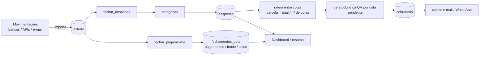

# Plano — Rateio Online (plataforma genérica de rateio de contas)

> Documento de planejamento. Nenhuma alteração de código é feita por este plano;
> ele serve de guia para implementação faseada e aprovada pelo responsável.

---

## 1. Visão geral

Evoluir o antigo **Auto Síndico** (focado em condomínios) para uma plataforma
genérica de **rateio de contas**, atendendo, com **um único fluxo**, situações como:

- **Condomínio**: contas chegam todos os meses e são classificadas em categorias
  (enel, sabesp, faxina etc.), rateadas entre os apartamentos.
- **Grupo / viagem**: uma pessoa pagou a despesa e os demais vão pagando a ela
  mês a mês.

O comportamento atual do condomínio **continua funcionando da mesma forma**; a
mudança é de **nomenclatura** (termos genéricos) e de **modelagem** (um núcleo
único que suporta parcelamento ao longo do tempo).

O projeto passa a se chamar **Rateio Online** (`rateio-online`) — já aplicado nos
manifests do ArgoCD, nas GitHub Actions e no `crontab`.

---

## 2. Glossário genérico (mapeamento de nomes)

| Conceito atual (condomínio) | Conceito novo (genérico) | Significado |
|---|---|---|
| Prédio (`predios`) | **Rateio** (`rateios`) | agrupamento de contas a dividir (condomínio, viagem, churrasco etc.) |
| Síndico (`sindico_id`) | **Organizador** (`organizador_id`) | usuário dono/gestor do rateio |
| Apartamento (`apartamentos`) | **Cota** (`cotas`) | unidade de participação que recebe/paga uma parte do total |
| Morador (`moradores`) | **Membro** (`membros`) | participante vinculado a uma cota |
| Caixa (`caixa`, `caixa_geral`) | **Fundo** e **Saldo** (`fechamentos_cota`) | reserva extra opcional + apuração do que cada cota pagou/deve |
| Categoria de despesa (`categorias_despesa`) | **Categoria** (`categorias`) | classificação dos gastos (contas ou itens da viagem) |
| Despesa geral (`despesas_geral`) | **Despesa** (`despesas`) | gasto a ratear (mensal ou pontual) |
| Extrato (`extrato`) | **Extrato** (`extrato`) | transação bancária (débito ou crédito) |
| Caixa manual (`caixa_manual`) | **Fundo manual** (`fundo_manual`) | transferência pontual de fundo entre cotas (ajuste avulso do mês) |
| Fechamento de despesas (`fechamento_despesas`) | **Cobrança** (`cobrancas`) | QR/cobrança gerado por cota |
| Classificação manual (`classificacao_manual`) | **Classificação manual** | regra manual: marcar movimentação em categoria |
| `admin`/`maintainer`/`user` (perfis) | **`organizador`** / **`membro`** | papéis genéricos |

---

## 3. Fluxo único de rateio

Não existem dois fluxos; existe **um só**, usado por todos os cenários:

### 3.1 Passos

1. **Importar movimentações** — extratos bancários (Pluggy, PagBank, Mercado Pago,
   e-mail, Drive) gravados em `extrato`.
2. **Classificar débitos** — `fechar_despesas` casa cada débito com uma **categoria**
   (automático por identificadores; `classificacao_manual` tem prioridade) e grava em `despesas`.
3. **Ratear** — `parcela(cota) = total_despesas ÷ nº de cotas ativas`.
4. **Classificar créditos** — `fechar_pagamentos` casa cada crédito com a **cota**
   pelos identificadores do membro responsável e grava `fechamentos_cota`.
5. **Apurar fundo/saldo** — ver seção 5.
6. **Cobrar** — gera QR Pix por cota pendente e envia e-mail/WhatsApp.
7. **Acompanhar** — dashboard com despesas, pagamentos, saldo e pendências por rateio.

### 3.2 Como o cenário viagem usa o mesmo fluxo

- O organizador cria o rateio **"Viagem Floripa"** com cotas = viajantes.
- A despesa da viagem (passagem, hospedagem, alimentação...) é registrada **uma vez**
  como despesas nas categorias correspondentes.
- `fechar_despesas` calcula a **parcela devida** por cota.
- A cota de quem pagou fica com **saldo credor**; as demais com **saldo devedor**.
- Nos meses seguintes, os créditos dos demais (pagando o organizador) são casados
  e **reduzem o saldo devedor** de cada cota — o mesmo passo 4/5 do fluxo acima.
- As cobranças mensais mostram apenas o **valor restante** de cada cota.

Não há branch "condomínio" vs "viagem": a única diferença é a **frequência** das
despesas (mensal vs pontual), resolvida pelo **saldo acumulado** da seção 5.

### 3.3 Funcionalidades atuais do condomínio (mantidas e usadas como referência)

Todas as funcionalidades que atendem o condomínio hoje são **preservadas 1:1** no
novo modelo — apenas com nomes genéricos e listas dinâmicas (em vez de AP1–AP4
fixos). A tabela abaixo é a referência da implementação genérica:

| Funcionalidade atual (rota/arquivo) | Comportamento mantido | Equivalente genérico |
|---|---|---|
| Importação de extrato — `POST /extrato`, `POST /movimentos-pagbank`, `GET /mail`, `GET /drive` | Lê Pluggy/Mercado Pago/PagBank/e-mail/Drive e grava as transações | `extrato` (mesmos provedores) |
| Fechamento de despesas — `POST /fechamento-despesas` | Classifica débitos por categoria (identificadores), grava despesas e gera QR por apartamento (último dia do mês após 19h, ou sem validação de mês) | `despesas` + `cobrancas`, com categorias dinâmicas |
| Fechamento de pagamentos — `POST /fechamento-pagamentos` | Casa créditos com o apartamento pelos identificadores do morador; caixa = excedente (`pagamentos − valor_mensal`) ou identificado por `caixa_pago_por` | `fechamentos_cota` (pagamentos/fundo/saldo) |
| Caixa configurável — `valor_caixa_padrao`, `valor_caixa` | Fundo padrão por prédio, sobrescrito por apartamento | `valor_fundo_padrao`, `valor_fundo` |
| Caixa manual — `POST /caixa-manual` | Transferência pontual de caixa entre apartamentos no mês (ajuste avulso) | `fundo_manual` (seção 5.5) |
| Cobrança por e-mail — `POST /cobrar` | Envia e-mail com QR Pix ao morador responsável e marca como enviado | `cobrancas` + membro responsável |
| Cobrança por WhatsApp — `POST /cobrar-whatsapp` | Envia WhatsApp com QR Pix e marca a notificação | idem |
| QR Pix — `POST /qrcode` | Gera QR (hoje com dados fixos do recebedor) | dados do **rateio** (recebedor/chave/CEP) |
| Resumo — `POST /resumo` | Lista transações avulsas por período | mantém (`extrato`) |
| Dashboard — `GET /` | Despesas, pagamentos, caixa, pendente e saldo por prédio | dinâmico por rateio + `saldo` acumulado por cota |
| Resumo WhatsApp — `POST /send-whatsapp` | Envia mensagem de resumo do mês | mantém, genérico |
| Autenticação/perfis — login, cadastro, confirmação de e-mail | Perfis `admin`/`maintainer`/`user` | perfis `organizador`/`membro` |
| Gestão (CRUD) — prédios, apartamentos, moradores, categorias | Cadastro/edição de prédio, apartamento, morador e categoria | rateios, cotas, membros, categorias |
| Classificação manual — `GET/POST /classificacao` | Marcar um débito específico em uma categoria | mantém |
| Multi-tenancy | Síndico vê seus prédios; morador vê só o próprio apartamento | Organizador vê seus rateios; membro vê só a própria cota |

> Regra de ouro da implementação: **nenhuma dessas funcionalidades é removida ou
> dividida em dois fluxos** — apenas renomeadas e tornadas dinâmicas. O seed da
> seção 9 reproduz exatamente o cenário condomínio atual (AP1–AP4, caixa R$ 100,
> categorias enel/sabesp/faxina/outros).

---

## 4. Banco de dados (novo, criado do zero)

Banco MySQL (mesmo `config/database.py`). Como será um **novo banco**, todas as
tabelas são criadas do zero; as tabelas antigas fixas (`caixa`, `despesas` com
colunas `ap1..4`) **deixam de existir**.

### 4.1 `usuarios` (mantida, com novos perfis)

| coluna | tipo | obs |
|---|---|---|
| `id` | INT PK AI | |
| `nome` | VARCHAR(255) | |
| `email` | VARCHAR(255) UNIQUE | |
| `senha_hash` | VARCHAR(512) | |
| `perfil` | VARCHAR(20) | `organizador` ou `membro` |
| `ativo` | BOOL | default false |
| `created_at` | DATETIME | |

### 4.2 `rateios` (ex-`predios`)

| coluna | tipo | obs |
|---|---|---|
| `id` | INT PK AI | |
| `organizador_id` | INT FK `usuarios.id` | ex-`sindico_id` |
| `nome` | VARCHAR(255) | ex.: "Condomínio Jardim", "Viagem Floripa" |
| `descricao` | VARCHAR(255) NULL | ex-`endereco` (opcional) |
| `valor_fundo_padrao` | DECIMAL(10,2) | ex-`valor_caixa_padrao` (default `0.00`) |
| `pluggy_client_id` | VARCHAR(255) NULL | credencial Pluggy do rateio (opcional) |
| `pluggy_client_secret` | VARCHAR(255) NULL | credencial Pluggy do rateio (opcional) |
| `pluggy_account_id` | VARCHAR(255) NULL | conta Pluggy do rateio (opcional) |
| `ativo` | BOOL | default true |
| `created_at` | DATETIME | |

> As credenciais Pluggy (`pluggy_*`) tornam a importação de extrato **por rateio**:
> quando preenchidas, o `POST /extrato` (provider `pluggy`) usa a conta de cada
> rateio; as movimentações são gravadas com `extrato.rateio_id` e os
> fechamentos consultam apenas as movimentações do próprio rateio (ou as globais,
> com `rateio_id` nulo).

### 4.3 `cotas` (ex-`apartamentos`)

| coluna | tipo | obs |
|---|---|---|
| `id` | INT PK AI | |
| `rateio_id` | INT FK `rateios.id` | ex-`predio_id` |
| `identificador` | VARCHAR(50) | ex.: `AP1`, `101`, `João` |
| `descricao` | VARCHAR(50) NULL | ex-`numero` |
| `valor_fundo` | DECIMAL(10,2) NULL | ex-`valor_caixa`; NULL = usa `rateios.valor_fundo_padrao` |
| `ordem` | INT | |
| `ativo` | BOOL | default true |
| `created_at` | DATETIME | |

> Cada cota pode ter **um ou mais membros** (participantes daquela cota).

### 4.4 `membros` (ex-`moradores`)

| coluna | tipo | obs |
|---|---|---|
| `id` | INT PK AI | |
| `cota_id` | INT FK `cotas.id` | ex-`apartamento_id` |
| `usuario_id` | INT FK `usuarios.id` NULL | vínculo opcional com conta |
| `nome` | VARCHAR(255) | |
| `email` | VARCHAR(255) NULL | |
| `telefone` | VARCHAR(50) NULL | WhatsApp |
| `identificadores_pagamento` | JSON | termos que casam com `extrato.identificacao` |
| `ativo` | BOOL | default true |
| `created_at` | DATETIME | |

### 4.5 `categorias` (ex-`categorias_despesa`)

| coluna | tipo | obs |
|---|---|---|
| `id` | INT PK AI | |
| `rateio_id` | INT FK `rateios.id` | |
| `nome` | VARCHAR(100) | ex.: `enel`, `sabesp`, `passagem`, `hospedagem` |
| `identificadores` | JSON | termos do extrato para classificação automática |
| `cor` | VARCHAR(20) NULL | |
| `ordem` | INT | |
| `ativo` | BOOL | default true |
| `created_at` | DATETIME | |

### 4.6 `despesas` (ex-`despesas_geral`)

| coluna | tipo | obs |
|---|---|---|
| `id` | INT PK AI | |
| `rateio_id` | INT FK `rateios.id` | |
| `mes` | VARCHAR(255) | |
| `ano` | INT | |
| `categoria_id` | INT FK `categorias.id` | |
| `valor` | DECIMAL(10,2) | |
| `created_at` | DATETIME | |

**Chave lógica:** `(rateio_id, mes, ano, categoria_id)`.

### 4.7 `extrato`

| coluna | tipo | obs |
|---|---|---|
| `id` | INT PK AI | |
| `banco` | VARCHAR(50) | |
| `data` | DATE | |
| `transacao` | VARCHAR(255) | |
| `tipo_transacao` | VARCHAR(50) | débito / crédito |
| `identificacao` | VARCHAR(255) | quem pagou/recebeu |
| `valor` | DECIMAL(10,2) | |
| `codigo_transacao` | VARCHAR(255) UNIQUE | chave de negócio (usada pela classificação manual) |

### 4.8 `fechamentos_cota` (ex-`caixa_geral`)

| coluna | tipo | obs |
|---|---|---|
| `id` | INT PK AI | |
| `rateio_id` | INT FK `rateios.id` | |
| `cota_id` | INT FK `cotas.id` | |
| `mes` | VARCHAR(255) | |
| `ano` | INT | |
| `pagamentos` | DECIMAL(10,2) | total creditado no período para a cota |
| `fundo` | DECIMAL(10,2) | ex-`caixa` (reserva/excedente do período) |
| `saldo` | DECIMAL(10,2) | saldo acumulado da cota (ver seção 5) |
| `created_at` | DATETIME | |

**Chave lógica:** `(rateio_id, cota_id, mes, ano)`.

### 4.9 `fundo_manual` (ex-`caixa_manual`)

| coluna | tipo | obs |
|---|---|---|
| `id` | INT PK AI | |
| `rateio_id` | INT FK `rateios.id` | |
| `mes` | VARCHAR(255) | |
| `ano` | INT | |
| `cota_pagadora_id` | INT | |
| `cota_destino_id` | INT | |
| `valor` | DECIMAL(10,2) | |
| `usuario_id` | INT NULL | |
| `created_at` | DATETIME | |

> Regra pontual de ajuste: ver **5.5 Fundo manual** para o comportamento e a
> prioridade em relação ao cálculo automático.

### 4.10 `cobrancas` (ex-`fechamento_despesas`)

| coluna | tipo | obs |
|---|---|---|
| `id` | INT PK AI | |
| `mes` | VARCHAR(255) | |
| `ano` | INT | |
| `cota` | VARCHAR(50) | identificador (compatibilidade de exibição) |
| `cota_id` | INT NULL | FK lógica para `cotas.id` |
| `valor` | DECIMAL(10,2) | |
| `qrcode` | TEXT | |
| `brcode` | TEXT | |
| `url_qrcode` | VARCHAR(255) | |
| `status` | VARCHAR(20) | `pendente` / `enviado` |
| `notificacao_whatsapp` | VARCHAR(20) | `pendente` / `enviado` |
| `data_atual` | VARCHAR(50) NULL | |

### 4.11 `classificacao_manual`

| coluna | tipo | obs |
|---|---|---|
| `id` | INT PK AI | |
| `rateio_id` | INT FK `rateios.id` | |
| `codigo_transacao` | VARCHAR(255) | |
| `categoria_id` | INT FK `categorias.id` | |
| `usuario_id` | INT NULL | |
| `created_at` | DATETIME | |

---

## 5. Regras de negócio

### 5.1 Parcela (ex-`valor_mensal`)

`parcela(cota) = total_despesas(rateio, período) ÷ nº de cotas ativas`

- Hoje o comportamento é `total / 4`; passa a ser dinâmico por rateio.
- Peso por cota (cotas desiguais) fica como evolução futura, sem mudar o fluxo.

### 5.2 Fundo (ex-`caixa`)

Mantém a regra atual, com nomes genéricos:

1. `rateios.valor_fundo_padrao` define o default (condomínio: `100.00`; viagem: `0.00`).
2. `cotas.valor_fundo` sobrescreve por cota.
3. Qualquer **membro** da cota que fizer um pagamento (identificado no extrato pelos
   `identificadores_pagamento`) soma ao `pagamentos` da cota; o fundo é o excedente
   (`pagamentos − parcela`) e entra na cobrança da cota.

Casos pontuais de transferência entre cotas são tratados pelo **fundo manual** (5.5).

### 5.3 Saldo acumulado (generalização para a viagem)

Para um fluxo único atender despesas **mensais** e **pontuais**, além do fundo
mensal, cada cota passa a ter **saldo acumulado**:

$$ saldo(cota) = pagamentos\_acumulados(cota) - parcelas\_devidas\_acumuladas(cota) $$

- `saldo > 0` → a cota pagou a mais (crédito/fundo);
- `saldo < 0` → a cota ainda deve;
- `saldo = 0` → quitado.

**Cota financiadora (quem adiantou as despesas):** o financiador é sempre **quem
criou o rateio** — a cota que possui um membro vinculado ao usuário organizador.
O saldo dela é apurado como
`saldo = saldo_anterior + (total_despesas − parcela) − pagamentos_das_demais_cotas`.
Assim, no cenário viagem, quem pagou tudo (o organizador) fica com saldo credor e
as demais cotas começam devedoras, abatendo a dívida conforme pagam. Se o
organizador não tiver cota no rateio, o fluxo segue sem financiadora (condomínio).

No **condomínio** (despesa e pagamento no mesmo mês), o saldo se comporta como o
`caixa` de hoje. Na **viagem** (despesa pontual + pagamentos ao longo dos meses),
o saldo é o que permite cobrar apenas o valor restante de cada cota.

> Implementação: `fechamentos_cota.saldo` é derivado a cada fechamento a partir do
> saldo anterior + `pagamentos` − `parcela` − ajustes de fundo. O dashboard e a
> cobrança passam a ler `saldo` em vez de apenas `caixa` do mês.

### 5.4 Classificação

1. `classificacao_manual` (regra manual) tem **prioridade** sobre a automática.
2. Automática: casa `extrato.identificacao` com os `identificadores` da
   categoria (débitos) ou com os `identificadores_pagamento` do membro (créditos).

### 5.5 Fundo manual (ex-`caixa_manual`)

O **fundo manual** é o ajuste avulso do período, herdado do `caixa_manual` atual.

- **O que é:** uma regra registrada para um mês/ano que **transfere** um valor de
  fundo/saldo de uma **cota pagadora** para uma **cota destino**.
- **Quando usar:** para ajustes avulsos do período — por exemplo, quando o pagamento
  de um membro deve ser transferido para outra cota. Não altera o cadastro da cota.
- **Como funciona (hoje, e preservado na versão genérica):**
  1. `fechar_pagamentos` calcula o fundo/saldo automático de cada cota (excedente
     de `pagamentos − parcela`).
  2. Em seguida aplica as regras de `fundo_manual` do período: para cada regra,
     move `min(valor, saldo_disponível_da_pagadora)` da cota pagadora para a destino.
  3. O resultado final é gravado em `fechamentos_cota`.
- **Prioridade:** aplicada **depois** do cálculo automático — funciona como ajuste
  final do período. É específica de um mês/ano.
- **Exemplo condomínio (atual):** em um mês, o fundo pago pelo AP2 deveria ir,
  excepcionalmente, para o AP4. Registra-se `fundo_manual(AP2 → AP4, R$ 100)`.
- **Exemplo viagem (mesmo fluxo):** Maria pagou a parcela de João neste mês →
  `fundo_manual(Maria → João, valor)` transfere o crédito correspondente; o saldo
  de João é abatido e o de Maria é creditado.
- **Validações:** pagadora e destino no **mesmo rateio**; valor > 0; destino ≠
  pagadora; opcionalmente rejeitar ciclos que invertam a apuração.

---

## 6. Camada de repositório (novos arquivos)

Seguir o padrão existente (`Base`, `get_session()`).

| Atual | Novo | Funções principais |
|---|---|---|
| `repository/predio.py` | `repository/rateio.py` | `Rateio`, `listar_por_organizador`, `buscar_por_id`, `salvar`, `desativar` |
| `repository/apartamento.py` | `repository/cota.py` | `Cota`, `listar_por_rateio`, `buscar_por_id`, `salvar` |
| `repository/morador.py` | `repository/membro.py` | `Membro`, `listar_por_cota`, `membro_contato`, `salvar` |
| `repository/categoria_despesa.py` | `repository/categoria.py` | `Categoria`, `listar_por_rateio`, `buscar_por_nome`, `salvar` |
| `repository/despesa_geral.py` | `repository/despesa.py` | `Despesa`, `upsert`, `total_por_rateio_mes` |
| `repository/caixa_geral.py` | `repository/fechamento_cota.py` | `FechamentoCota`, `upsert`, `listar_por_rateio_mes`, `saldo_anterior` |
| `repository/caixa_manual.py` | `repository/fundo_manual.py` | `FundoManual`, `listar_por_rateio_mes`, `salvar` |
| `repository/extrato.py` | mantém | `Extrato`, `consultar`, `gravar`, `listar_por_rateio` |
| `repository/fechamento_despesas.py` | `repository/cobranca.py` | `Cobranca`, `pendentes`, `marcar_status` |
| `repository/classificacao_manual.py` | mantém | `listar_por_rateio`, `salvar`, `remover` |
| `repository/usuario.py` | mantém | perfis `organizador`/`membro` |

> `repository/base.py` passa a registrar os novos modelos (remover os antigos).
> Tabelas antigas (`caixa`, `despesas` com `ap1..4`) **não são mais criadas**.
> `extrato` é criada por DDL próprio (`criar_tabela_extrato`)
> chamado na inicialização da aplicação.

---

## 7. Alterações nos serviços (remover hardcodes)

### 7.1 `service/fechamento_pagamento.py`
- Ler **cotas e membros** do banco (via repositório).
- Casamento de crédito com a cota por `identificadores_pagamento` — qualquer membro
  que pague soma ao `pagamentos` da cota.
- Gravar em `fechamentos_cota` (pagamentos, fundo, saldo) — em vez de `Caixa` fixo.
- Aplicar as regras de `fundo_manual` do período **após** o cálculo automático
  (ajuste final), antes de gravar (seção 5.5).
- Calcular `saldo` acumulado conforme seção 5.3.

### 7.2 `service/fechamento_despesas.py`
- Carregar categorias e identificadores de `categorias` (remover `sabesp/enel/outros` hardcoded).
- Respeitar `classificacao_manual` antes da automática.
- Gravar em `despesas` (uma linha por categoria).
- Gerar cobrança por cota usando `parcela` dinâmica e `fundo` configurado
  (apenas para o fundo que a própria cota paga).

### 7.3 `service/cobrar_service.py`
- Substituir `email_mapping`/`telefone_mapping` por consulta ao **membro responsável**
  da cota (`Membro.email`, `Membro.telefone`).

### 7.4 `service/qrcode_service.py`
- Dados do PIX (recebedor/cidade/chave/CEP) passam a vir da configuração do **rateio**
  (ou `.env`), não de valores fixos por prédio.

### 7.5 `service/dashboard.py`, `service/message_whatsapp.py`, `home.html`
- Iterar **cotas** dinamicamente em vez de `ap1..4`; agregar por `fechamentos_cota`/`despesas`.
- Exibir `saldo` acumulado por cota (essencial para a viagem).

### 7.6 `service/condominio_service.py` → `service/rateio_service.py`
- `valor_caixa_do_apartamento` → `valor_fundo_da_cota(predio, cota)`.

### 7.7 `util/identificadores.py`
- **Remover** o arquivo (dados fixos de condomínio).
- Substituir por **seed opcional** (seção 9) que recria o condomínio padrão no banco,
  preservando o comportamento atual.

---

## 8. Telas e rotas (renomeadas)

| Atual | Novo |
|---|---|
| `GET /predios` | `GET /rateios` |
| `POST /predios` | `POST /rateios` |
| `GET /predios/{id}` | `GET /rateios/{id}` |
| `POST /apartamentos` | `POST /cotas` |
| `GET /apartamentos/{id}` | `GET /cotas/{id}` |
| `POST /apartamentos/{id}` | `POST /cotas/{id}` |
| `POST /moradores` | `POST /membros` |
| `POST /moradores/{id}` | `POST /membros/{id}` |
| `GET /categorias` | `GET /categorias` (mantém) |
| `GET /classificacao` | `GET /classificacao` (mantém) |

**Templates renomeados:**

- `predios.html` → `rateios.html`
- `predio.html` → `rateio.html`
- `apartamento.html` → `cota.html`
- `categorias.html`, `classificacao.html` mantêm o nome (texto genérico)
- `home.html`, `template.html`, `login.html`, `cadastro.html`, `email.html`:
  atualizar títulos e textos de "Auto Síndico/prédio/apartamento/morador" para
  "Rateio Online/rateio/cota/membro".

**Navegação (`template.html`):** links **Rateios**, **Cotas**, **Categorias**,
**Classificação** (organizador vê tudo; membro vê somente a própria cota).

---

## 9. Seed do condomínio padrão (preserva o comportamento atual)

Como o banco nasce vazio e `util/identificadores.py` é removido, criar
**`scripts/seed_rateio_condominio.py`** (opcional, executado manualmente) que recria:

- `Rateio` "Condomínio Padrão" com `valor_fundo_padrao = 100.00`;
- `Cotas` `AP1..AP4` (`valor_fundo`: AP1 = 0; AP2/AP3/AP4 = 100);
- `Membros` com os mesmos nomes/e-mails/telefones/identificadores atuais;
- `Categorias` `enel`, `sabesp`, `faxina`, `outros` com os identificadores atuais.

Assim, o cenário condomínio continua **idêntico ao atual** sem nenhum dado fixo no código.

---

## 10. Segurança multi-rateio

- **Escopo por organizador:** toda consulta de `rateios`/`cotas`/`categorias` filtra
  por `rateio.organizador_id == usuario.id` (perfil `admin` de plataforma vê tudo, se existir).
- **Membro:** acessa somente os dados da sua cota (via `membros.usuario_id`).
- **Fundo entre cotas:** validar que as regras de `fundo_manual` apontam para cotas
  do **mesmo rateio** e sem ciclos.
- Validar **em todas as rotas** que o recurso pertence ao organizador da sessão (evitar IDOR).

---

## 11. Fases de implementação

### Fase 1 — Banco e repositórios
1. Criar os novos repositórios da seção 6 (tabelas criadas do zero no novo banco).
2. Atualizar `repository/base.py` para registrar os novos modelos.
3. Criar `scripts/seed_rateio_condominio.py`.

### Fase 2 — Serviços dinâmicos
4. Refatorar `fechamento_pagamento.py` (fechamentos_cota + saldo).
5. Refatorar `fechamento_despesas.py` (categorias dinâmicas + classificação manual + fundo).
6. Refatorar `cobrar_service.py` (membro responsável).
7. Refatorar `qrcode_service.py` (dados do rateio).
8. Refatorar `dashboard.py`, `message_whatsapp.py`, `home.html` (dinâmico + saldo).

### Fase 3 — Telas e rotas
9. Renomear rotas e templates conforme seção 8.
10. Atualizar navegação e textos.

### Fase 4 — Classificação manual e fundo manual
11. Tela `classificacao.html` + rotas de classificação.
12. Tela de fundo manual entre cotas (ex-`caixa_manual`) com prioridade sobre a
    configuração e validações de mesmo rateio.

### Fase 5 — Testes e deploy
13. Testar fluxo condomínio (idêntico ao atual) e fluxo viagem (pagamento parcelado).
14. Publicar imagem `cbeloni/rateio-online:{amd64,arm64}` e validar ArgoCD/crontab.

---

## 12. Compatibilidade e riscos

| Risco | Mitigação |
|---|---|
| Quebrar o fluxo atual do condomínio | Mesmo fluxo; apenas renomear e generalizar saldo; seed reproduz AP1–AP4 |
| Rotas/URLs antigas (`/predios`, `/apartamentos`) quebram | Manter redirecionamentos temporários (opcional) durante a transição |
| `crontab`/ArgoCD apontando para host antigo | Já atualizados para `rateio-online.beloni.dev.br` |
| Cobrança da viagem não considera o saldo restante | Cobrança passa a usar `fechamentos_cota.saldo` |
| Membro sem identificador no extrato | `classificacao_manual` como correção; dashboard mostra "não classificado" |
| Vários responsáveis na mesma cota | Validar 1 responsável por cota na tela |
| Rateio sem categorias | Seed automático ao criar rateio (categorias padrão editáveis) |
| Segurança entre rateios (IDOR) | Filtro `organizador_id` em toda consulta; testes de acesso cruzado |
