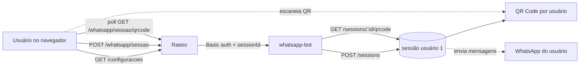
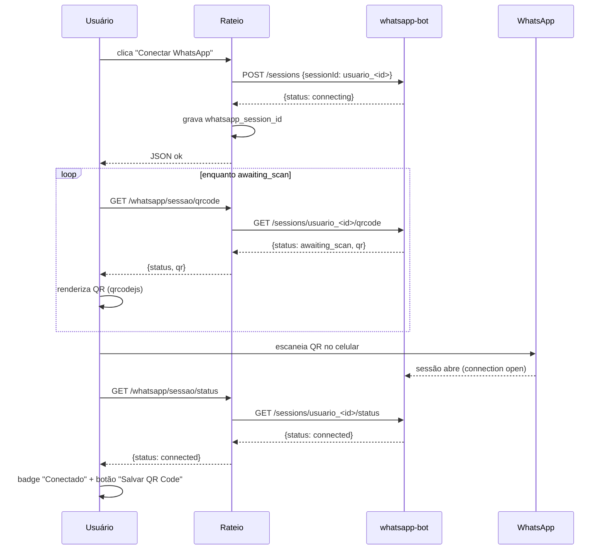

# Plano: Configurações do usuário + WhatsApp multi-sessão (QR por usuário)

> Data: 2026-08-17 · Contexto: permitir que cada usuário logado conecte o seu próprio
> WhatsApp via QR Code na tela de configurações, e renomear o menu "Perfil" para "Configuração".
>
> Documento de planejamento. Nenhuma alteração de código é feita por este plano;
> ele serve de guia para implementação faseada e aprovada pelo responsável.

---

## 1. Visão geral

Hoje o `whatsapp-bot` (projeto separado em `/Users/cauebeloni/Documents/whatsapp-bot`,
entrypoint `index.js`) mantém **uma única sessão** do WhatsApp (`sockInstance`) com um único
QR Code impresso no terminal. O `rateio` apenas envia mensagens por essa sessão (endpoints
`POST /sendmessage` e `POST /sendimage`).

Objetivo: evoluir para **multi-sessão** — uma sessão por usuário do `rateio` —, expor
**endpoints para ler N QRCodes (um por usuário)** e permitir que a tela de configuração do
usuário (antiga "Perfil") **exiba e salve o QR Code** de pareamento.

Mudanças em duas bases de código:

1. **`rateio`** (este projeto): menu, tela de configurações, modelo de dados, endpoints de proxy.
2. **`whatsapp-bot`**: multi-sessão + novos endpoints de QR/status.

---

## 2. Diagnóstico do estado atual

### 2.1 Rateio

| Item | Onde está | Observação |
|---|---|---|
| Menu do usuário | `templates/template.html` (dropdown `userMenu`) | Item "Perfil" (`fa-user-circle`) → `/perfil` |
| Rota da tela | `api/rotas/autenticacao.py` → `pagina_perfil` (`GET /perfil`) | Renderiza `perfil.html` |
| Tela | `templates/perfil.html` | Só mostra nome, e-mail, perfil, data e logout |
| Modelo usuário | `repository/usuario.py` (`Usuario`) | Sem campo de sessão WhatsApp |
| Chamada ao bot | `service/send_whatsapp.py` | `send_whatsapp_message` / `send_whatsapp_image` com Basic auth (`WHATSAPP_USER`/`WHATSAPP_PASS`) |

### 2.2 whatsapp-bot

| Item | Onde está | Observação |
|---|---|---|
| Entrypoint | `index.js` (Dockerfile `CMD ["node", "index.js"]`) | Sessão única em `auth_info` |
| Servidor HTTP | `index.js` → `startHttpServer` | Só `POST /sendmessage` e `POST /sendimage` |
| QR Code | `index.js` → `sock.ev.on("connection.update")` | `qrcode.generate(qr, { small: true })` imprime no terminal; **não é exposto via HTTP** |
| Autenticação | `index.js` **não valida** o header `Authorization` | O `rateio` envia Basic, mas o bot ignora |
| Arquivos legados | `whatsapp.js`, `providers/*.js` | Estrutura antiga; hoje não usada pelo entrypoint |
| Auth do bot | `.env` → `APP_USERNAME`/`APP_PASSWORD` (valores `caue`/`back1234`) | Disponíveis, mas não aplicados |

---

## 3. Arquitetura alvo



- O `rateio` guarda, por usuário, o `whatsapp_session_id` que identifica a sessão no bot.
- O bot mantém um **mapa de sessões** (`Map<sessionId, SessionState>`), cada uma com seu
  próprio `sock`, sua pasta de credenciais (`auth_info/<sessionId>`) e seu QR em memória/disco.

---

## 4. Mudanças no `whatsapp-bot`

### 4.1 Estado multi-sessão

Substituir `sockInstance`/`isWhatsappReady` por:

```js
// Map<sessionId, { sock, ready, qr, qrUpdatedAt, reconnectAttempts, reconnectTimeout, isConnecting }>
const sessions = new Map();
```

Cada sessão usa `useMultiFileAuthState("auth_info/" + sessionId)` (ou `auth_info_<sessionId>`).

### 4.2 Novos endpoints (HTTP, porta 3000)

Todos passam a exigir Basic auth (`APP_USERNAME`/`APP_PASSWORD` do `.env`) — hoje o bot ignora.

| Método | Rota | Corpo | Resposta | Observação |
|---|---|---|---|---|
| `POST` | `/sessions` | `{ sessionId, name? }` | `{ sessionId, status: "connecting" }` | Cria/garante a sessão (idempotente). `sessionId` deve ser estável, ex.: `usuario_<id>` |
| `GET` | `/sessions/:id/qrcode` | — | `{ sessionId, status, qr }` | `qr` é a string crua do Baileys (ou null). `status` ∈ `awaiting_scan` / `connected` / `error` |
| `GET` | `/sessions/:id/status` | — | `{ sessionId, status, connected }` | Status atual sem QR (para polling leve) |
| `GET` | `/sessions` | — | `{ sessions: [...] }` | Lista sessões + status (admin/diagnóstico) |
| `DELETE` | `/sessions/:id` | — | `{ success: true }` | `sock.logout()`, remove do Map e apaga `auth_info/<sessionId>` |
| `POST` | `/sendmessage` | `{ number, message, sessionId? }` | como hoje | `sessionId` opcional; sem ele usa a sessão **default** (retrocompatível) |
| `POST` | `/sendimage` | `{ number, imageUrl, caption?, sessionId? }` | como hoje | idem |

### 4.3 Captura e persistência do QR

Em `sock.ev.on("connection.update")`, quando `update.qr` existir:

1. Guardar em memória: `session.qr = update.qr; session.qrUpdatedAt = Date.now()`.
2. **Salvar em disco**: escrever a string em `auth_info/<sessionId>/qrcode.txt` e, opcionalmente,
   gerar um PNG (`qrcode` npm) em `auth_info/<sessionId>/qrcode.png` — atende o requisito
   "salvar o QR Code" e permite re-servir após restart (o QR expira, então o arquivo é só
   para conveniência/imagem).
3. Não imprimir mais no terminal (ou manter como fallback de log).

### 4.4 Reconexão por sessão

Mover `scheduleReconnect`/`clearAuthState` para o escopo da sessão (`session.reconnectTimeout`,
`session.reconnectAttempts`), para que uma sessão desconectada não afete as demais.

### 4.5 Sessão default (retrocompatibilidade)

Manter um `DEFAULT_SESSION_ID` (ex.: `"default"`). Ao subir, o bot restaura a sessão
`default` a partir de `auth_info/default` (equivale à sessão atual). Assim, `POST /sendmessage`
sem `sessionId` continua funcionando como hoje.

---

## 5. Mudanças no `rateio`

### 5.1 Modelo de dados

Tabela `usuarios` ganha:

| coluna | tipo | obs |
|---|---|---|
| `whatsapp_session_id` | VARCHAR(64) NULL | id estável da sessão no bot (ex.: `usuario_<id>`) |
| `whatsapp_conectado` | BOOLEAN default FALSE | cache de status (atualizado por polling/status) |

> Alternativa: tabela separada `whatsapp_sessoes`. Recomendo coluna simples, já que a relação
> é 1:1 (um usuário, uma sessão). Migração em `migrations/` (Alembic, padrão do projeto).

### 5.2 Rotas (`api/rotas`)

| Método | Rota | Descrição |
|---|---|---|
| `GET` | `/configuracoes` | Renomeia `pagina_perfil`; renderiza `perfil.html` (nova tela) |
| `GET` | `/perfil` | Redireciona para `/configuracoes` (retrocompatível) |
| `POST` | `/whatsapp/sessao` | Cria sessão no bot (`POST /sessions` com `sessionId = usuario_<id>`); grava `whatsapp_session_id` |
| `GET` | `/whatsapp/sessao/qrcode` | Proxy do QR do bot; retorna `{ status, qr }` (JSON, AJAX) |
| `GET` | `/whatsapp/sessao/status` | Proxy do status do bot; atualiza `whatsapp_conectado` |
| `DELETE` | `/whatsapp/sessao` | Desconecta no bot e limpa os campos |

### 5.3 Serviço (`service/`)

Criar `service/whatsapp_sessao_service.py` (ou estender `send_whatsapp.py`):

- Helper único `_bot_request(method, path, payload=None)` com Basic auth reutilizável.
- Funções `criar_sessao`, `obter_qrcode`, `obter_status`, `excluir_sessao`.
- Tratamento de erros do bot (503 "não conectado", timeout) com mensagens claras para a tela.

### 5.4 Menu

Em `templates/template.html`, no dropdown `userMenu`:

- Trocar rótulo **"Perfil"** → **"Configuração"** e ícone `fa-user-circle` → `fa-cog`.
- Trocar o texto do cabeçalho do dropdown `Perfil: <badge>` por `Acesso: <badge>` (evitar
  dois usos da palavra "Perfil").

### 5.5 Tela `perfil.html` (nova "Configurações")

Reorganizar em **tabs** (Bootstrap):

1. **Conta** — dados atuais (nome, e-mail, perfil, cadastro) + botão "Sair".
2. **WhatsApp** — seção de pareamento:
   - Badge de status: `Desconectado` / `Aguardando leitura` / `Conectado`.
   - Botão **"Conectar WhatsApp"** → chama `POST /whatsapp/sessao`.
   - Área do **QR Code** (gerado no front via lib `qrcodejs` CDN a partir da string `qr`),
     exibida enquanto `status == awaiting_scan`.
   - Botão **"Salvar QR Code"** → baixa/exporta a imagem (ou salva o PNG servido pelo bot).
   - Botão **"Desconectar"** → `DELETE /whatsapp/sessao`.
   - Polling via `fetch` a cada ~3s em `GET /whatsapp/sessao/qrcode` enquanto aguarda leitura;
     ao detectar `connected`, para o polling e mostra sucesso.

### 5.6 Ajuste de layout

- Título da página: `Meu Perfil` → `Configurações`.
- Ícone da seção: `fa-id-card` → `fa-cog`.
- Usar `nav-tabs` já estilizadas no `template.html` para separar "Conta" e "WhatsApp".

---

## 6. Fluxo de pareamento (fim a fim)



---

## 7. Passos de implementação (fases)

### Fase 1 — whatsapp-bot multi-sessão

1. Refatorar `index.js`: `sessions` Map + `ensureSession(sessionId)` (idempotente).
2. Pasta de credenciais por sessão (`auth_info/<sessionId>`).
3. Capturar e persistir `qr` (memória + `qrcode.txt`/`qrcode.png`).
4. Endpoints novos (`/sessions`, `/sessions/:id/qrcode`, `/sessions/:id/status`,
   `/sessions`, `DELETE /sessions/:id`).
5. `sessionId` opcional em `/sendmessage` e `/sendimage` (default session retrocompatível).
6. Basic auth em **todos** os endpoints (usar `APP_USERNAME`/`APP_PASSWORD`).
7. Reconexão por sessão.
8. Testar localmente: `curl` para criar sessão, ler QR e enviar mensagem.

### Fase 2 — rateio (dados + serviço)

1. Migração Alembic: colunas `whatsapp_session_id` e `whatsapp_conectado` em `usuarios`.
2. `repository/usuario.py`: expor novos campos em `to_dict()`.
3. `service/whatsapp_sessao_service.py`: helper Basic + funções de sessão.

### Fase 3 — rateio (rotas + tela)

1. Renomear rota para `/configuracoes` + redirect de `/perfil`.
2. Rotas `POST/GET/DELETE /whatsapp/sessao...` (protegidas por `exigir_login`).
3. Menu `template.html`: "Configuração".
4. Nova `perfil.html`: tabs "Conta" + "WhatsApp", QR via `qrcodejs`, botão salvar QR,
   polling de status.
5. Integrar com o `#feedbackModal` existente (erros com stacktrace).

### Fase 4 — validação e deploy

1. Testar pareamento completo com 2 usuários simultâneos.
2. Conferir que `cobrar_service` continua usando a sessão default (sem regressão na cobrança).
3. Deploy do bot (Dockerfile já roda `node index.js`; adicionar volume para as novas pastas
   `auth_info/*`).
4. Atualizar `crontab`/README se necessário.

---

## 8. Riscos / pontos de atenção

1. **QR expira rápido** (geralmente ~60s; o Baileys regenera). O polling e o "Salvar QR"
   devem considerar que um QR salvo pode já estar inválido — servir sempre o `qr` mais recente.
2. **Sessão por usuário × limite de dispositivos do WhatsApp**: cada conta só pode estar
   pareada em um lugar; se o mesmo número for pareado em outra sessão, a anterior cai.
3. **Auth do bot ausente hoje**: adicionar Basic auth pode quebrar chamadas antigas que não
   enviam header — o `rateio` já envia, então deve ser transparente. Validar antes de liberar.
4. **Retrocompatibilidade da cobrança**: manter sessão default para `send_whatsapp.py` atual
   (cobranças continuam saindo pelo número pareado no "default").
5. **Persistência de sessão**: pastas `auth_info/<sessionId>` devem ser volumes no
   `docker-compose` do bot, senão a sessão se perde no redeploy.
6. **Nome do projeto**: `whatsapp-bot` fica fora do workspace `rateio`; os edits são feitos em
   `/Users/cauebeloni/Documents/whatsapp-bot` (arquivos reais, sem fork).
7. **CORS/HTTPS**: o polling do QR parte do navegador → `rateio` (não direto ao bot), então
   não é necessário expor o bot publicamente nem liberar CORS.

---

## 9. Fora de escopo (não alterar)

- Lógica de cobrança (`cobrar_service.py`) e destinatários por membro/cota.
- Autenticação/confirmação de e-mail.
- Envio de mídia existente (`send_whatsapp_image`).
- Estrutura legada `providers/*.js`/`whatsapp.js` (pode ser removida em limpeza separada).
